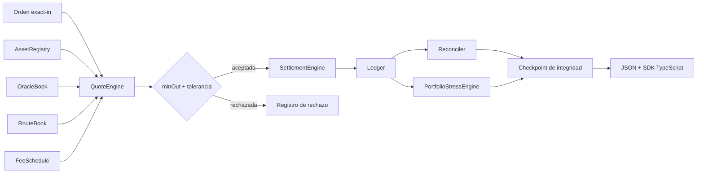

# AuroraDTL


AuroraDTL es un motor determinista de pricing y liquidación multi-activo escrito
en C++17. Procesa rutas internas, precios secuenciados, tolerancias, comisiones,
ventanas operativas y movimientos de ledger a partir de escenarios JSON
reproducibles. Su salida estable está orientada a tesorería, conciliación,
simulación previa y automatización operativa.

[](https://github.com/SolguardLabs/AuroraDTL/actions/workflows/ci.yml)
[](https://github.com/SolguardLabs/AuroraDTL/actions/workflows/release-integrity.yml)


## Arquitectura



La ruta crítica separa catálogo, valoración, simulación y movimiento contable.
El plano operativo añade stress correlacionado, concentración, cobertura de
reservas y una huella determinista del estado. La autenticidad de esa huella
corresponde al sistema de firma externo.

## Capacidades

- assets con precisión nativa de 0 a 18 decimales y estados operativos;
- precios secuenciados con antigüedad, confianza y banda de desviación;
- rutas de uno o varios saltos con tolerancia y comisión específica;
- órdenes exact-in con `minOut`, ventana, memo y modo quote-only;
- ledger por cuenta y activo con aritmética comprobada;
- desglose de fees y cuenta de tesorería;
- conciliación de débitos, créditos, rutas y eventos;
- stress de cartera con shock, haircut de accesibilidad, HHI y déficit;
- checkpoints secuenciales con enlace anterior y aprobación por quórum;
- SDK TypeScript de precisión entera sin dependencias de ejecución;
- compilación reproducible en Windows y Linux.

## Componentes

| Ruta               | Responsabilidad                                         |
| ------------------ | ------------------------------------------------------- |
| `src/amount.*`     | Importes enteros, escalas decimales y conversiones      |
| `src/asset.*`      | Catálogo, estado, límites y precisión de activos        |
| `src/oracle.*`     | Secuencias, frescura, confianza y desviación de precios |
| `src/route.*`      | Definición y simulación de rutas multi-salto            |
| `src/quote.*`      | Cotización, `minOut`, tolerancia y fees                 |
| `src/settlement.*` | Ejecución y eventos de liquidación                      |
| `src/ledger.*`     | Balances y movimientos por cuenta                       |
| `src/risk.*`       | Exposición y controles de catálogo                      |
| `src/stress.*`     | Pérdida correlacionada, HHI y cobertura                 |
| `src/checkpoint.*` | Huella determinista y registro con quórum               |
| `src/reconcile.*`  | Agregación y conciliación contable                      |
| `sdk/`             | Conversión, estimación y cliente tipado                 |

## Modelo de precio

Para una entrada `A_s` en precisión `d_s`, precios `P_s`, `P_d` y precisión de
destino `d_d`:

```text
units_s  = A_s / 10^d_s
units_d  = units_s · P_s / P_d
gross_d  = round(units_d · 10^d_d)
index_18 = round(units_d · 10^18)
fee      = floor(gross_d · fee_bps / 10,000)
net_d    = gross_d - fee
```

El consumidor debe tratar cada importe junto con su activo y precisión. No se
deben comparar enteros de dominios decimales distintos sin una conversión
explícita. El modelo completo está en [docs/modelo-economico.md](./docs/modelo-economico.md).

## Inicio rápido

Requisitos: Node.js 24, npm y un compilador C++17 (`cl`, `g++`, `clang++` o
`c++`).

```bash
npm ci --ignore-scripts
npm run build
npm test
```

Validar y ejecutar un escenario:

```bash
out/auroradtl validate tests/fixtures/balanced_quote.json
out/auroradtl quote tests/fixtures/precision_quote.json --json
out/auroradtl run tests/fixtures/balanced_quote.json --json --events
```

En Windows el script también localiza Visual Studio Build Tools 18, 2022 o una
instalación disponible mediante `vcvars64.bat`.

## Contrato de entrada

```json
{
  "scenario": "eur-usd-window",
  "clock": { "timestamp": 1800000360, "window": 30000001 },
  "assets": [],
  "prices": [],
  "fees": { "defaultBps": 10, "feeAccount": "treasury" },
  "accounts": [],
  "routes": [],
  "orders": []
}
```

Los importes son cadenas de enteros en precisión nativa. Consulta
[docs/integracion.md](./docs/integracion.md) para el esquema de campos y la
semántica de errores.

## SDK TypeScript

```typescript
import { parseUnits, planWindow, quoteByPrice } from "./sdk/AuroraClient.ts";

const input = parseUnits("0.000001", 18);
const output = quoteByPrice(input, 18, 6, 3000n * 10n ** 8n, 1n * 10n ** 8n);
const plan = planWindow(30_000_001n, 30_000_001n, 40_000n, 100_000n, 25_000n);

console.log({ output, accepted: plan.accepted, remaining: plan.remainingRaw });
```

El cliente sólo ejecuta lecturas y cálculos deterministas. El proceso integrador
controla rutas de archivos, firma, aislamiento y publicación de resultados.

## Validación

La suite ejecuta dos compilaciones con warnings como errores, 22 comprobaciones
funcionales nativas/Node y 3 controles del artefacto público. CI repite el flujo
en `ubuntu-latest` y `windows-latest`.

```bash
npm run ci
npm run format:check
```

## Documentación

- [Arquitectura](./docs/arquitectura.md)
- [Modelo económico](./docs/modelo-economico.md)
- [Modelo de seguridad](./docs/modelo-seguridad.md)
- [Gobierno](./docs/gobierno.md)
- [Operaciones](./docs/operaciones.md)
- [Integración](./docs/integracion.md)
- [Despliegue](./docs/despliegue.md)

## Versión

`v1.0.0` fija C++17, Node.js 24 y Prettier 3.6.2. `main`, `production` y la
etiqueta anotada de la release deben apuntar al mismo commit.

## Licencia

[MIT](./LICENSE) © 2026 SolguardLabs.
