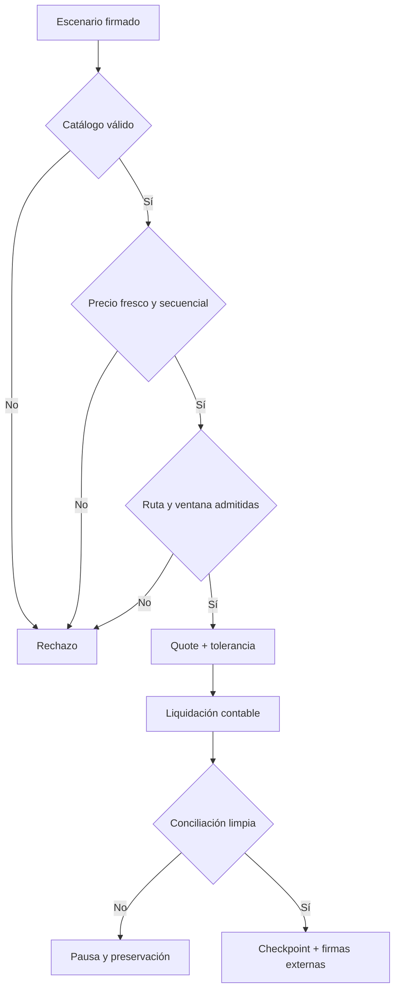

# Política de seguridad

AuroraDTL aplica defensa por capas a catálogo, oráculos, rutas, ventanas,
liquidación y conciliación. Los despliegues deben separar publicación de
precios, operación, tesorería, revisión de riesgo y firma de checkpoints.

## Versiones mantenidas

| Versión   | Estado            |
| --------- | ----------------- |
| `1.0.x`   | Mantenida         |
| `< 1.0.0` | Sin mantenimiento |

## Superficie incluida

Código C++ en `src/`, SDK, scripts, workflows, fixtures y parámetros descritos
en `docs/`. Quedan fuera binarios recompilados por terceros, credenciales,
fuentes de precio externas, sistemas de firma y frontends no incluidos.

## Invariantes críticas

- todo asset de una ruta, precio o balance existe en el catálogo;
- cada actualización de precio aumenta la secuencia;
- un precio fuera de banda no reemplaza el último valor aceptado;
- el débito nunca excede el saldo de la cuenta;
- `minOut` y tolerancia se evalúan antes del movimiento contable;
- cada fee se atribuye a la cuenta de tesorería configurada;
- las ventanas no mezclan capacidad consumida de periodos distintos;
- cada checkpoint enlaza el anterior y usa una secuencia contigua;
- el quórum nunca supera el conjunto de revisores habilitados;
- la conciliación usa eventos del mismo resultado y de la misma ventana.

## Gestión de incidentes

1. Detener nuevas órdenes para la ruta o activo afectado.
2. Conservar escenario, binario, commit, salida JSON y checkpoint.
3. Registrar timestamp, ventana, secuencias de precio y balances iniciales.
4. Comparar quote, settlement, fees y movimientos de ledger.
5. Ejecutar conciliación y stress sobre una copia aislada.
6. Preparar el cambio mediante revisión independiente y release firmada.
7. Reanudar sólo después de dos checkpoints consecutivos reconciliados.

## Comunicación privada

Usa la pestaña **Security** del repositorio. No publiques detalles técnicos en
issues. Incluye versión, sistema operativo, compilador, fixture mínimo, comando,
salida observada, impacto económico y medidas temporales. No adjuntes claves,
tokens ni datos personales.

El equipo acusará recibo en un máximo de 72 horas y comunicará una evaluación
inicial en siete días naturales. La coordinación posterior depende del alcance,
la reproducibilidad y las medidas operativas disponibles.

Consulta [docs/modelo-seguridad.md](./docs/modelo-seguridad.md) y
[docs/operaciones.md](./docs/operaciones.md).
