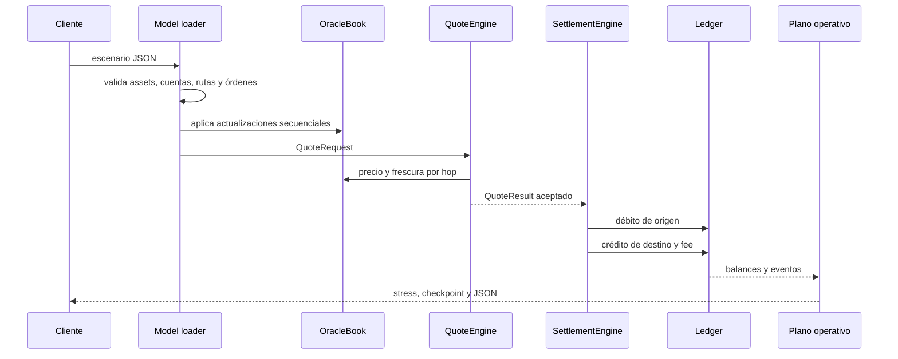

# Arquitectura

AuroraDTL divide la ejecución en catálogo, valoración, decisión, contabilidad y
observabilidad. Las estructuras usan enteros de 64 bits para importes y
`long double` únicamente para precios, nocionales y escenarios de stress.

## Flujo principal

## Límites de responsabilidad

`AssetRegistry` define precisión, estado, tolerancia, mínimo, máximo y permiso
de liquidación. `OracleBook` no obtiene precios: valida puntos entregados por el
plano de control. `RouteBook` simula cada hop. `QuoteEngine` aplica la política
económica. `SettlementEngine` ejecuta el movimiento. `Ledger` conserva balances
y eventos sin conocer precios.

El plano operativo lee el estado resultante. `Reconciler` cruza movimientos y
resultados, `PortfolioStressEngine` valora exposición y `CheckpointBuilder`
produce una huella estable. Esa huella no sustituye una firma digital; permite
que un servicio externo firme exactamente el mismo estado canónico.

## Datos deterministas

Las entradas se ordenan cuando el orden no tiene significado económico. Los
eventos conservan el orden de ejecución. El JSON serializa importes como cadenas
para evitar pérdida de precisión en consumidores JavaScript.

## Dependencias

El binario no enlaza librerías externas. Node.js orquesta builds, tests y el SDK.
Esta separación reduce superficie de suministro y permite compilar en MSVC,
GCC y Clang con warnings tratados como errores.
