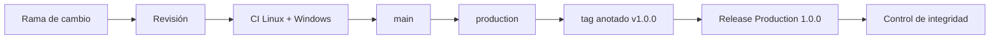

# Despliegue

## Toolchain fijado

- estándar C++17;
- Node.js 24;
- npm con `package-lock.json`;
- Prettier 3.6.2;
- MSVC, GCC o Clang con warnings como errores.

## Build local

```bash
npm ci --ignore-scripts
npm run ci
```

En Windows se busca primero un compilador en `PATH` y después Visual Studio
Build Tools mediante `vcvars64.bat`. En Linux se prueba `c++`, `g++` y `clang++`.

## Artefactos

```text
out/auroradtl[.exe]
out/aurora_native_tests[.exe]
package-lock.json
assets/banner.png
```

Los binarios de `out/` no se versionan. El pipeline debe publicar checksums,
compilador, flags, commit y sistema operativo junto al paquete firmado.

## Promoción



La promoción sólo es válida cuando `main`, `production` y el objeto pelado del
tag coinciden. El workflow de release comprueba también que la versión de
`package.json` coincide con el tag.

## Rollback

No se mueve una etiqueta publicada. Un rollback crea un nuevo commit y una
nueva versión, conserva el artefacto anterior y registra qué ventanas fueron
procesadas con cada binario. Antes de reanudar, se reconcilia desde el último
checkpoint firmado.
