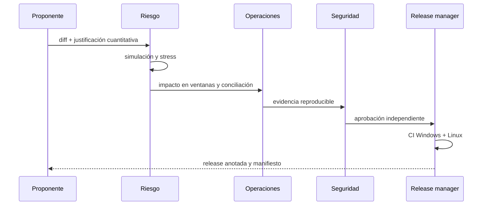

# Gobierno

AuroraDTL no incluye un servicio de identidad. La organización operadora debe
aplicar separación de funciones y cambios revisables sobre configuración,
fixtures canónicos y releases.

## Cambios sujetos a control reforzado

- alta, pausa o retirada de un activo;
- precisión decimal y límites mínimo/máximo;
- fuente, banda o antigüedad de precio;
- alta, desactivación o modificación de una ruta;
- tolerancia y componentes de fee;
- capacidad y duración de ventana;
- censo y quórum de revisores;
- versión de compilador o workflow de release.

## Flujo recomendado

## Ventanas de cambio

Los cambios ordinarios deben anunciarse con una ventana suficiente para que
integradores revaliden fixtures. Una pausa de emergencia puede ser inmediata,
pero su levantamiento exige una revisión equivalente a un cambio ordinario y
dos checkpoints conciliados.

## Evidencia

Cada cambio conserva commit anterior y nuevo, fixture de simulación, versión de
compilador, salida de tests, resultado de stress, digest del checkpoint y lista
de aprobadores. Las decisiones económicas deben incluir unidades y redondeo.
