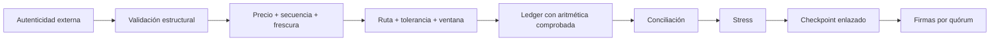

# Modelo de seguridad

## Actores

| Actor                 | Responsabilidad             | No debe controlar             |
| --------------------- | --------------------------- | ----------------------------- |
| Publicador de precios | Entrega puntos secuenciados | Tesorería o release           |
| Operador              | Ejecuta ventanas aprobadas  | Cambio unilateral de catálogo |
| Riesgo                | Define límites y stress     | Firma única de checkpoints    |
| Tesorería             | Custodia fees y reservas    | Publicación de precios        |
| Revisor               | Aprueba checkpoints         | Modificación de balances      |
| Release manager       | Promueve artefactos         | Operación diaria              |

## Capas de control

La CLI comienza después de la autenticidad: no verifica firmas de entrada. El
integrador debe autenticar el escenario y aislar rutas de archivos. La huella
de checkpoint es determinista para comparación; la resistencia criptográfica y
la identidad de firmantes pertenecen a un servicio externo.

## Checkpoint

La representación canónica incluye versión, secuencia, ventana, digest anterior,
escenario, balances ordenados y eventos en orden de ejecución. El registro exige:

- secuencia contigua;
- coincidencia exacta con el digest final anterior;
- una única propuesta pendiente;
- revisores únicos;
- quórum positivo que no supere el censo;
- prohibición de retirar un revisor que rompería el quórum.

## Supuestos

- el host de ejecución controla acceso al binario y a los fixtures;
- el reloj y la ventana provienen de una fuente autorizada;
- las fuentes de precio ya han sido autenticadas;
- los límites económicos son coherentes con la liquidez disponible;
- los firmantes externos verifican commit, binario y digest.

Si un supuesto deja de cumplirse, la respuesta segura es detener la ruta,
preservar evidencia y reconciliar desde el último checkpoint aceptado.
